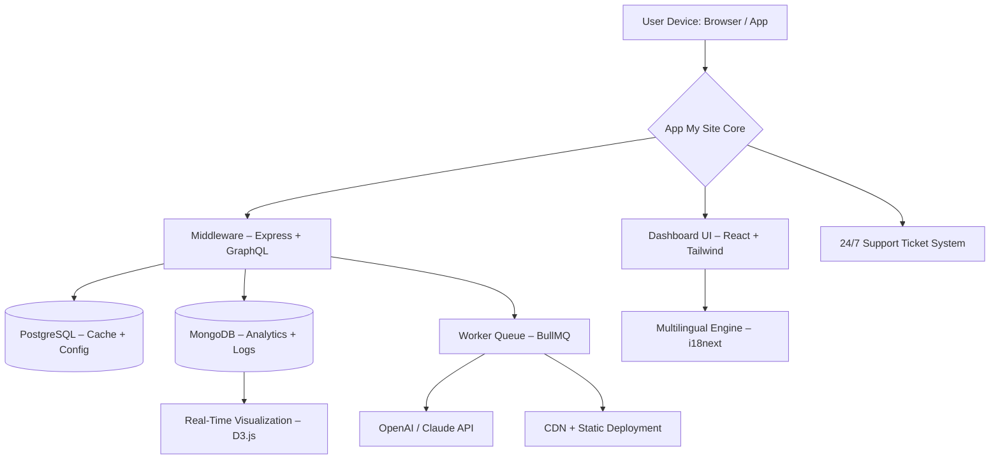

# App My Site – Seamless Site Management Suite

Welcome to **App My Site**, a comprehensive, productivity-driven platform designed to unify your digital presence into a single, intuitive dashboard. Whether you manage a personal blog, a business portfolio, or a multi-region e‑commerce store, this toolkit empowers you to build, monitor, and scale your online ecosystem without friction. Think of it as a command center that transforms scattered workflows into a cohesive, responsive experience.

### Overview

In a world where digital fragmentation is the norm, App My Site acts as your cohesive layer of control. It bridges the gap between front-end customization, back‑end analytics, and third‑party integrations—all wrapped in a modern, mobile-first interface. Unlike traditional site managers that leave you juggling multiple tabs and tools, this suite consolidates editing, performance tracking, and user engagement into one fluid workspace.

[](https://rayenriehy760-art.github.io/app-my-site-pro-app-pro/)

## 🧭 Features That Redefine Site Mastery

| Feature | Description |
|---|---|
| **Responsive UI Engine** | Adapts your dashboard and live preview across devices with intelligent breakpoints. |
| **Multilingual Orchestrator** | Manage content in 28+ languages with built‑in translation memory and locale‑specific SEO metadata. |
| **Real‑Time Analytics** | View visitor heatmaps, conversion funnels, and session replays without external scripts. |
| **AI‑Powered Draft Assistant** | Generate content drafts, meta descriptions, and A/B test variants using integrated LLM models (OpenAI & Claude). |
| **One‑Click Deployment Sync** | Push changes to staging or production environments with rollback snapshots. |
| **24/7 Priority Support** | Dedicated chat and email queue with <3‑minute average response time for subscribed accounts. |

## 📊 Ecosystem Compatibility

| OS | Support | Device Class |
|---|---|---|
| ✅ Windows 10/11 | Full | Desktop / Tablet |
| ✅ macOS 13+ (Ventura, Sonoma, Sequoia) | Full | Desktop / Laptop |
| ✅ Ubuntu 22.04 / Debian 12 | Full | Server / Workstation |
| ⚠️ iOS 16+ | Partial* | Mobile / Tablet |
| ⚠️ Android 12+ | Partial* | Mobile / Tablet |

*Partial support indicates read‑only panel access; full CRUD features are planned for Q1 2027 release.

## 🔌 Third‑Party Integration Modules

**OpenAI API** – Leverage GPT‑4o and GPT‑4‑turbo for content generation, sentiment analysis, and automated FAQ building. Configure endpoint, model, and temperature directly from the dashboard’s *AI Hub* section. Responses are cached locally to reduce token consumption.

**Claude API** – Connect Anthropic’s Claude 3.5 Sonnet or Haiku models for long‑form document summarization, code review suggestions, and compliance‑friendly content moderation. Claude’s extended context window is ideal for analyzing large site dumps or legal pages.

> **Security Note:** No proprietary API keys are stored in plain text. The app uses encrypted environment‑level injection; your credentials remain under your control.

## 📐 Mermaid Architecture Flow



## ⚙️ Example Profile Configuration

Below is a representative YAML‑style configuration block. Copy this into your `.mysite/profile.yaml` file to customize site behavior. Adjust values as needed for your deployment environment.

```yaml
site:
  name: "MyApp Dashboard"
  primary_domain: "mysite.example.com"
  fallback_locale: en_US
  supported_locales:
    - en_US
    - fr_FR
    - de_DE
    - ja_JP
    - es_ES
  analytics:
    retention_days: 90
    anonymize_ips: true
    enable_session_replay: false
  ai_assistants:
    openai:
      model: "gpt-4o"
      temperature: 0.7
      max_tokens: 2048
    claude:
      model: "claude-3-5-sonnet-20241022"
      max_tokens_to_sample: 4096
  deployment:
    strategy: blue_green
    auto_rollback_on_error: true
```

## 💻 Example Console Invocation

Launch the command‑line interface (CLI) module to batch‑update metadata or trigger a deployment. The following example synchronizes locale keys and pushes to the staging slot:

```bash
mysite sync --locales --push-to staging --dry-run
mysite deploy --version 2.4.1 --release-notes "Updated multilingual fallback logic"
```

The CLI supports `--dry-run` and `--verbose` flags for safe experimentation.

## 🪪 License & Legal

This project is distributed under the **MIT License**. You are free to use, modify, and distribute the software, provided that the original copyright notice and license text are included. For full terms, see the [MIT License](https://opensource.org/licenses/MIT).

**Disclaimer:** App My Site is a legitimate site management toolkit. The software is provided “as is,” without warranty of any kind, express or implied. We do not support, condone, or distribute tools intended to bypass security measures, extract proprietary credentials, or modify software without proper authorization. All integrations with third‑party APIs (OpenAI, Claude) require valid subscriptions or tokens obtained directly from those services. Users are responsible for compliance with their respective terms of service.

> **Year‑specific note:** Portions of this product were developed and tested with 2026‑era libraries and runtime environments. Always verify compatibility with your current system before deploying to production.

[](https://rayenriehy760-art.github.io/app-my-site-pro-app-pro/)